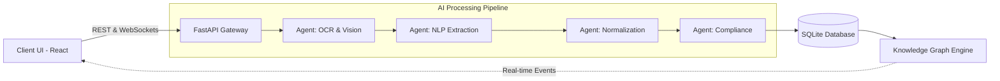

<div align="center">
  
# ⚡ SPECForge AI
**Product Intelligence, Verified. Automated Extraction for Industrial Datasheets.**


</div>

<br />

**SPECForge AI** is an advanced, multi-agent AI orchestrator designed to ingest, extract, and normalize complex industrial data sheets (PDFs, Images, DXF) into a fully structured, queryable knowledge graph. 

Stop manually entering spec sheets. Let SPECForge automatically scan for compliance, build product relationships, and verify taxonomy with high-confidence AI extraction.

---

## ✨ Key Features

- 🧠 **Multi-Agent Orchestration:** Specialized AI agents handle reading, extraction, normalization, taxonomy matching, and compliance validation.
- 📊 **Interactive Knowledge Graph:** Visualize product relationships, duplicates, and compatibility in a stunning 3D interactive layout.
- ⚡ **Real-Time Processing Observatory:** Drag & drop spec sheets and watch the live multi-step AI pipeline process your document.
- 📥 **Instant Report Generation:** Download high-quality PDF and JPG intelligence extraction reports instantly after scanning.
- 🌓 **Dynamic Theming Engine:** Fully custom Dark, Light, and a striking "Mixed" UI theme using Tailwind CSS v4 class-based variants.
- 💬 **Database-Aware AI Assistant:** Ask natural language questions; the assistant queries your live SQLite product catalog directly.

---

## 🏗️ System Architecture

SPECForge AI operates on a modern, decoupled architecture ensuring high performance and real-time UI updates:



- **Frontend:** Built with React 19, Vite, and Tailwind CSS v4. Features fluid animations powered by Framer Motion and beautiful iconography from Lucide.
- **Backend:** High-speed asynchronous Python server using FastAPI.
- **Database:** SQLite & SQLAlchemy for lightweight, robust persistence.
- **Real-time Engine:** WebSockets ensure the dashboard updates live as jobs process.

---

## 🚀 Getting Started

### 1. Clone the Repository
```bash
git clone https://github.com/Deebiga21/SpecForage-AI.git
cd SpecForage-AI
```

### 2. Start the Backend (FastAPI)
```bash
cd backend
python -m venv venv
source venv/bin/activate  # On Windows use `venv\Scripts\activate`
pip install -r requirements.txt
python -m uvicorn main:app --reload --port 8000
```
*Note: Ensure your `.env` file is configured with the necessary AI API keys.*

### 3. Start the Frontend (Vite/React)
In a new terminal window:
```bash
cd frontend
npm install
npm run dev
```

### 4. Open the App
Navigate to `http://localhost:5173` in your browser. 
Login and navigate to the **Settings** page to explore the live appearance preview and new Mixed theme!

---

## 🎨 UI/UX Highlights

- **Live Theme Preview:** The Settings page instantly propagates Light, Dark, or Mixed themes across the entire app before you even hit save.
- **Graceful Fallbacks:** If the database is completely empty, the app utilizes highly detailed fallback mock data so you can always view the Knowledge Graph and Product UI.
- **Review Drawer:** Contextual slide-out drawer for human-in-the-loop verification on low-confidence AI extractions.

---

<div align="center">
  <i>Built for the modern industrial workflow.</i>
</div>
